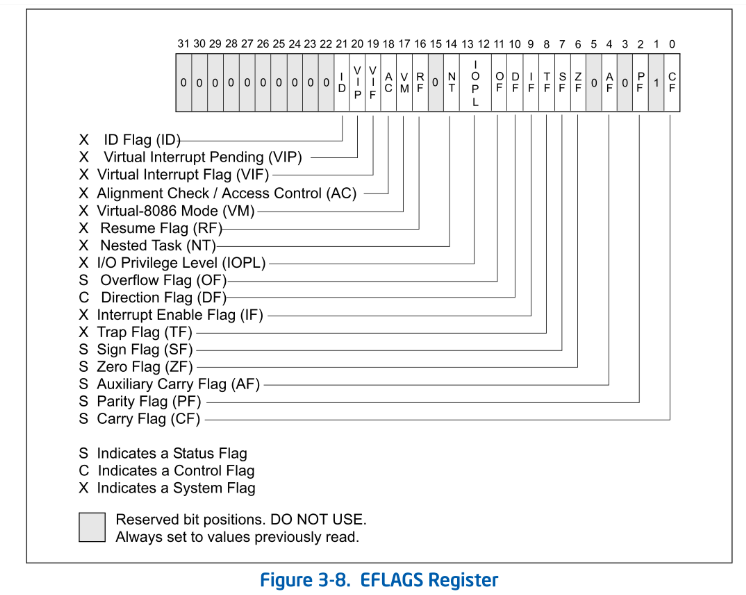

## 0. 内容介绍

层次划分

## 1. 处理器状态及状态转换

### 处理器定义

略，prosses' processor

### 处理器构成

运算器、控制器、**寄存器**、**高速缓存**

#### 寄存器

- 用户可见寄存器——数据寄存器、地址寄存器、条件码寄存器
- 控制和状态寄存器

### 特权指令和非特权指令

特权指令——只能系统调用

非特权指令——用户可以调用

### 处理器的工作状态

管态——内核态、特权态、系统态

目态——用户态、普通态

#### 处理器工作状态转换

目态到管态——通过中断

管态到目态——设置PSW指令(修改程序状态字)

### 程序状态字(PSW)

指示处理器状态的寄存器

包含以下状态代码：

1. CPU工作状态代码——管态or目态
2. 条件码——指令执行后的结果特征
3. 中断屏蔽码——指令是否允许中断

进阶

http://blog.csdn.net/whatday/article/details/8621410

## 2. 中断、异常机制

### 中断、异常概念

中断——处理器对异步事件的相应

异常——执行指令引发

异步事件——无一定时序关系发生的随机事件

### 中断处理流程

- 中断请求接收
- 中断响应
- 中断处理

### 常见中断类型

- I/O中断——解决：重启IO
- 时钟中断——
- 硬件故障中断
- 程序性中断
- 系统服务请求

###中断、异常响应过程

//TODO

## 3. 计算机系统相关硬件

### 存储系统

分类：

RAM——random access memory随机访问存储器——读写，断电丢失

ROM——read only memory只读存储器

### IO

- 通道
- DMA——direct memory access
- 缓冲

###时钟

分类：

- 绝对时钟——系统关机仍然运行
- 相对时钟

## 4. 系统调用

目态变为管态，只能由汇编进入。

//为控制系统调用服务的机构称为陷入Trapor异常处理机构。