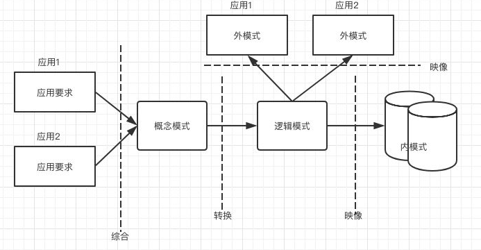
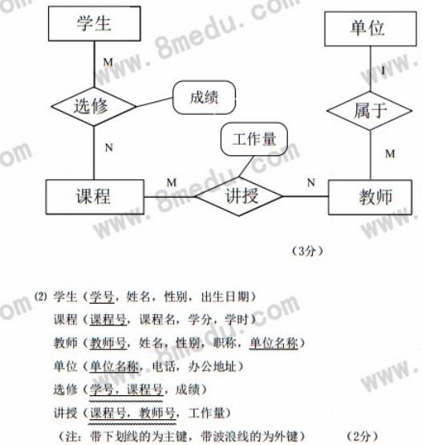

## 2. 数据库设计基本步骤

### 数据库设计过程

结构设计阶段：

- 概念结构设计
- 逻辑结构设计
- 物理结构设计

行为设计阶段：

- 功能设计
- 事务设计
- 程序设计

数据库实施阶段：

- 加载数据库数据
- 调试运行程序

### 数据库生存期

数据库系统生存期——数据库应用系统从开始规划、设计、实现、维护到最后被新的系统取代而停止使用的整个期间，称为数据库系统生存期。

###数据库设计步骤

1. 需求分析
2. 概念结构设计——关系设计
   1. 业务流程图
   2. 确定系统范式，产生系统关联图E-R
   3. 分析系统数据，产生数据字典
3. 逻辑结构设计——表设计
4. 物理结构设计——块大小、数据压缩等
5. 数据库实施
6. 数据库运行与维护

**关系规范化理论** 主要用于数据库设计中的**概念设计阶段**。

**数据应用过程** 可以借助**数据流程图**或其他信息及应用结构图形表示。

## 3. 关系数据库设计

### 关系数据库设计过程、各级模式

### 概念结构设计方法

概念设计步骤：

进行数据抽象，设计局部概念模型；

局部概念模型综合成全局概念模型；

评审

#### E-R图表示方法

略

#### 局部信息结构设计

略

#### 全部信息结构设计

略

### 逻辑结构设计方法

1. E-R图 转换 关系模式

1. 数据模型优化
2. 用户子模式——利用View视图，符合用户外模式

#### E-R图转关系模式示例

- 关系模式 中 转码用横线表示，外码用波浪线表示
- 联系单独用表表示

### 物理实际方法

1. 索引——使用频率高的属性
2. 聚集——相关数据集中存放

