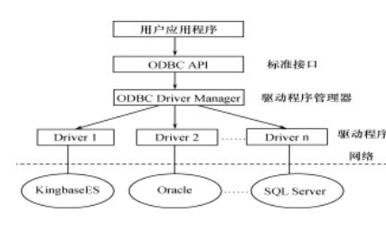

# 7.数据库应用设计与开发实例

## 1. SQL Server2000

<https://bsr1983.iteye.com/blog/856104>

SQL Server 2000的主要工具中，执行ToSQL的最佳轻量级工具——**查询分析器**

T-SQL语言中，在单个Declare命令中声明多个变量时，需要使用**逗号**隔开

SQL Server中专有的SQL语言拓展弥补SQL标准，称为**T-SQL**

DLL文件存放在安装路径的\bin目录下

触发器是SQL Server提供给程序员和数据分析员来保证**数据完整性**的一种方法，它是与表事件相关的特殊的**存储过程**

G-SQL中**if…else**语句的作用——if…else语句是条件判断语句，根据表达式的真假，执行某个语句或语句块

## 2. PowerBuilder 9.0

<https://bsr1983.iteye.com/blog/857101>

### 开发空间

WorkSpace(工作空间)、Target(目标)、Library(库文件)

工作空间是开发应用系统的“容器”，用户必须首先**建立或打开**一个工作空间才能进行开发。

目标用于描述加入到工作空间中的**应用**。一个工作空间可以建多个目标，一个目标对应一个拓展名为.pbt的文件。工作空间可以打开多个目标。

一个目标对应一个或多个拓展名为.pbl的文件

### PB9 工具栏

两组工具栏ToolBar——PowerBar工具栏、PaintBar画板工具栏

- PowerBar——主控菜单工具栏
- PaintBar——操纵画板组件工具栏

PowerBuilder 9.0提供的操作画板组件的工具——**PaintBar**

### PB9 主要画板

1. 窗口Window
2. **应用Application**——用来**创建和编辑应用对象**，可以对应用程序的Open、Close、Error等事件编程和对对象的属性进行修改。
3. 数据库DataBase
4. 数据窗口Data Window——功能最强大
5. **数据管道**Data Pipe Line——用于实现数据库内、数据库之间，甚至不同数据库系统之间**快速的数据转换**。实现统一处理不同的数据库，方便数据库的维护。
6. 函数Function
7. 库Library
8. 菜单Menu
9. 工程Project
10. 查询Query
11. 结构Structure
12. 用户对象User Object

### 具体问题

PowerBuilder 9.0中，提供规范化的Workspace(工作空间)对象，让程序员更方便地管理创建**应用对象**

**编辑窗口**——用于显示对开发人员做出的操作响应

PowerBuilder应用画板功能

## 3. OBDC

<http://dblab.xmu.edu.cn/post/12152/#kejianxiazai>

### 产生原因

不同数据库管理系统，不同RDBMS编写的应用程序不能通用。

### 原理

Open Data Base Connectivity——提供了一组访问数据库的API

类比java中的JDBC了

### 体系架构

1. 用户应用程序
2. **驱动程序管理器**
3. **数据库驱动程序**
4. ODBC数据源管理

#### 驱动程序管理器

包含在ODBC32.DLL中

为应用程序加载、调用和卸载DB驱动程序

#### 数据库驱动程序

ODBC 驱动程序。是一些DLL，提供了ODBC和数据库之间的接口

#### ODBC驱动程序

单束、多束

## 4. UML

UML类图中，关联的端部，也就是与关联相连的类，称为**关联角色**

在对象联系图中，表示两个属性之间值的联系为逆联系的是双向箭头

## 5. DBA

### DBA职责——全答就对了

定义模式、定义内模式

与用户联络

定义安全性规则，对用户访问数据库进行控制

定义完整性规则，监督数据库运行

数据库转储与恢复

## 5. 系统测试与维护

### 数据库的运行与维护阶段的主要工作

1. 数据库的转储与恢复
2. 数据库安全性、完整性控制
3. 数据库性能监督、分析和改进
4. 数据库的重组织和重构造

### 数据库试运行

定义——流程

在已建立的数据库上，按生产现场实际环境要求运行应用程序，进行对数据库各种操作，检验期功能和性能；

如有不当或错误，则应更具实际情况或修改应用程序、修改数据库物理模型，甚至修改逻辑模型

# 8. 数据库管理技术的发展

### 第三代数据库的开放性

支持数据库语言标准；

在网络上**支持标准网络协议**；

系统具有良好的**可移植性、可连接性、可拓展性和互操作性**

### 大数据特征

4V

海量的数据规模 volumn

快速的数据流转和动态数据体系 velocity

多样的数据类型 variety

巨大的数据价值(价值密度低) value